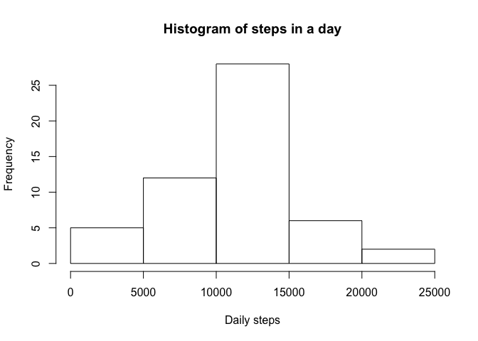
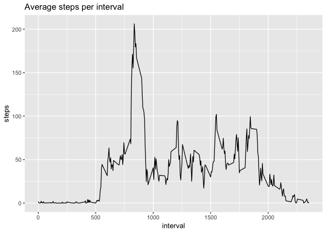
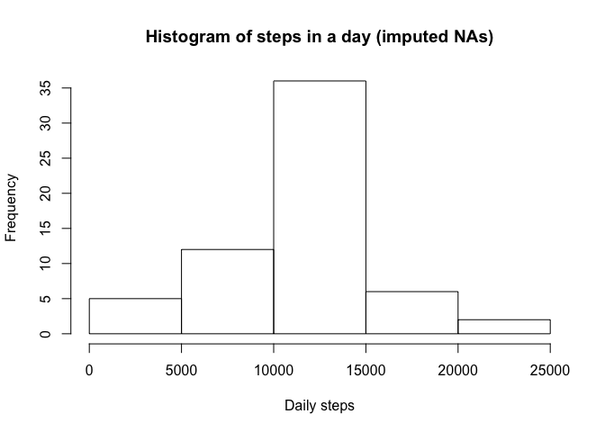
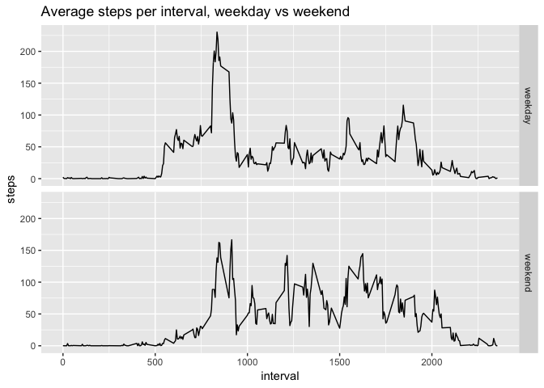

## Loading and preprocessing the data

# Load packages, check for file, download and unzip

```r
library(ggplot2, warn.conflicts = FALSE)
library(dplyr, warn.conflicts = FALSE)
filename <- 'reproducibleresearchassignment1'
fileURL <- 'https://d396qusza40orc.cloudfront.net/repdata%2Fdata%2Factivity.zip'

if (!file.exists(filename)){
        download.file(fileURL, filename, method="curl")
        unzip(filename)
}  
```

#read into dataframe


```r
activitydata <- read.csv('activity.csv')
```

## What is mean total number of steps taken per day?

Ans: histogram of daily steps

```r
# histogram, mean and median of daily sum of steps
dailysum <- aggregate(steps ~ date, activitydata, sum)
hist(dailysum$steps, main='Histogram of steps in a day', xlab = 'Daily steps')
```

<!-- -->

Ans: mean and median of daily steps

```r
mean(dailysum$steps)
```

```
## [1] 10766.19
```

```r
median(dailysum$steps)
```

```
## [1] 10765
```

## What is the average daily activity pattern?

Ans: average steps per interval

```r
intervalmean <- aggregate(steps ~ interval, activitydata, mean)
qplot(data=intervalmean, x=interval, y=steps, 
      geom='line', main='Average steps per interval')
```

<!-- -->
Ans: which interval has the largest average number of steps?

```r
intervalmean[which.max(intervalmean$steps),]
```

```
##     interval    steps
## 104      835 206.1698
```

## Imputing missing values

Ans: total number of NAs

```r
sum(is.na(activitydata$steps))
```

```
## [1] 2304
```

Ans: replace NAs with mean value for that interval

```r
navalues <- is.na(activitydata$steps)

# Step 1: create a column of interval means for every interval in the original data
mergeddata <- left_join(activitydata, intervalmean, by = "interval")

# Step 2: replace NAs in steps with the corresponding interval mean
mergeddata$steps.x[navalues] <- mergeddata$steps.y[navalues]

# Step 3: remove interval mean column and rename steps column
filledactivitydata <- mergeddata[1:3]
names(filledactivitydata)[1] <- 'steps'
```

Ans: histogram, mean and median of daily sum of steps using imputed data

```r
filleddailysum <- aggregate(steps ~ date, filledactivitydata, sum)
hist(filleddailysum$steps, 
     main='Histogram of steps in a day (imputed NAs)', 
     xlab = 'Daily steps')
```

<!-- -->

```r
mean(filleddailysum$steps)
```

```
## [1] 10766.19
```

```r
median(filleddailysum$steps)
```

```
## [1] 10766.19
```
Ans: The mean is the same as before while the median has increased. 

## Are there differences in activity patterns between weekdays and weekends?

Ans: mark each date with indicator of whether it's a weekday or a weekend

```r
# day of week for each date
filledactivitydata$dayofweek <- weekdays(as.Date(filledactivitydata$date))

# rename weekdays to "weekday" and weekends to "weekend"
weekends <- filledactivitydata$dayofweek %in% c("Saturday", "Sunday")
filledactivitydata[weekends,]$dayofweek <- "weekend"
filledactivitydata[!weekends,]$dayofweek <- "weekday"
filledactivitydata$dayofweek <- as.factor(filledactivitydata$dayofweek)
```
Ans: panel plot of weekday vs weekend activity by interval

```r
#panel plot
g <- ggplot(data=filledactivitydata, aes(x=interval, y=steps))
g + 
        stat_summary(fun.y='mean', geom='line') + 
        facet_grid(dayofweek ~ . ) +
        labs(title = 'Average steps per interval, weekday vs weekend')
```

<!-- -->
